# ✦ Wize Wizard

### Strategy · Mathematics · Execution · Learning

[](https://github.com/iamrichmack111/wize-wizard/actions/workflows/ci.yml)
[](https://github.com/iamrichmack111/wize-wizard/actions/workflows/security.yml)
[](https://github.com/iamrichmack111/wize-wizard/actions/workflows/codeql.yml)
[](https://github.com/iamrichmack111/wize-wizard/actions/workflows/deploy.yml)


> **Wize Wizard turns uncertainty into an executable project plan.** It connects strategic reasoning, PERT mathematics, task execution, team communication design, evidence, learning, and reporting in one Flask-based workbench.

<p align="center">
  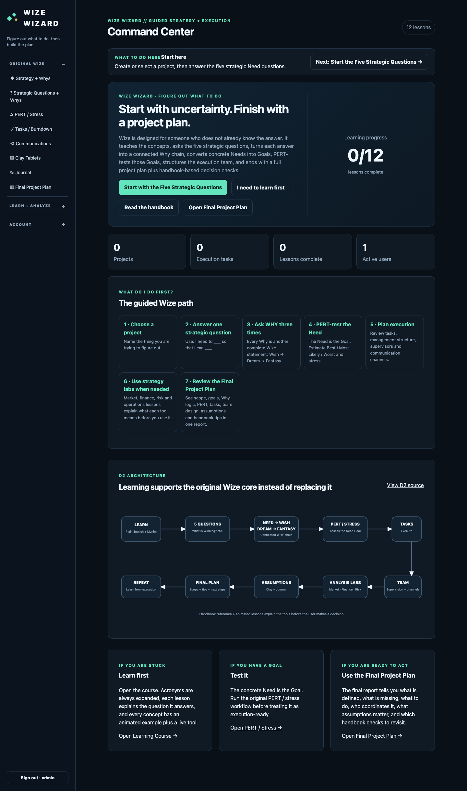
</p>

---

## ✦ Why Wize Wizard Exists

A project can fail long before implementation: the goal may be vague, the reason for doing it may be unclear, estimates may hide uncertainty, team communication can become chaotic, and assumptions may never be recorded.

Wize Wizard makes those layers explicit.

```text
Learn
  ↓
Five Strategic Questions
  ↓
I need to ______ so that I can ______
  ↓
Need → Wish → Dream → Fantasy
  ↓
PERT / Stress Analysis
  ↓
Tasks + Burndown
  ↓
Communication Structure
  ↓
Market + Finance + Risk
  ↓
Clay Tablets + Journal
  ↓
Final Project Plan
  ↓
Execute → Learn → Reassess
```

<p align="center">
  
</p>

## 🧭 Five Strategic Questions

Every project is examined through five questions:

1. **What is Winning?**
2. **Where Will I Play?**
3. **What Tools Do I Need?**
4. **What Management System Do I Need?**
5. **What Skills Do I Need?**

Answers use a deliberately concrete structure:

```text
I need to ______________________
so that I can __________________
```

That Need can become a task, receive a PERT estimate, accumulate evidence, and appear in the final plan.

<p align="center">
  
</p>

## 🧠 Connected Why Reasoning

Wize Wizard separates the executable goal from progressively deeper purpose:

```text
Need / Goal
    │
   WHY?
    ▼
Wish / Why 1
    │
   WHY?
    ▼
Dream / Why 2
    │
   WHY?
    ▼
Fantasy / Why 3
```

The **Need** remains concrete. Wish, Dream, and Fantasy explain why it matters.

<p align="center">
  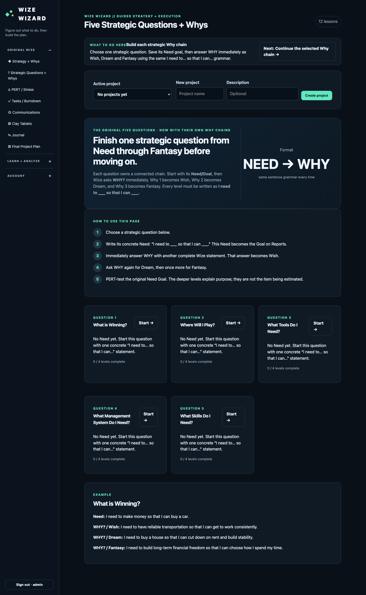
</p>

## 📐 PERT + Stress-Aware Planning

Wize Wizard uses three-point estimation:

| Input | Meaning |
|---|---|
| **O** | Optimistic estimate |
| **M** | Most likely estimate |
| **P** | Pessimistic estimate |

Expected duration:

```text
E = (O + 4M + P) / 6
```

Standard deviation:

```text
σ = (P - O) / 6
```

Central normal-distribution intervals are approximately:

| Range | Central interval |
|---|---:|
| ±1σ | 68% |
| ±2σ | 95% |
| ±3σ | 99.7% |

These central intervals are not the same thing as one-sided finish-by probabilities.

<p align="center">
  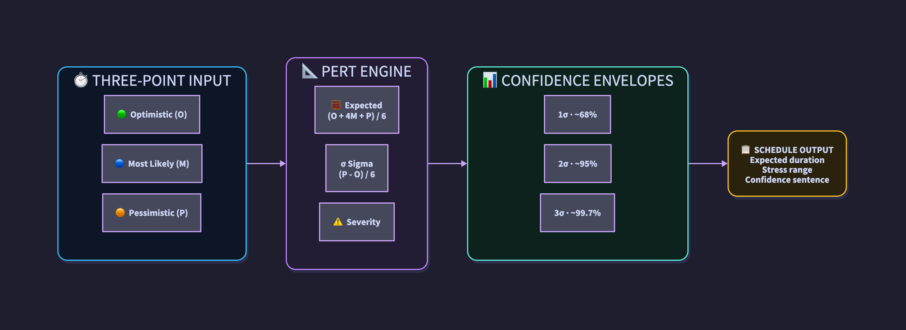
</p>

<p align="center">
  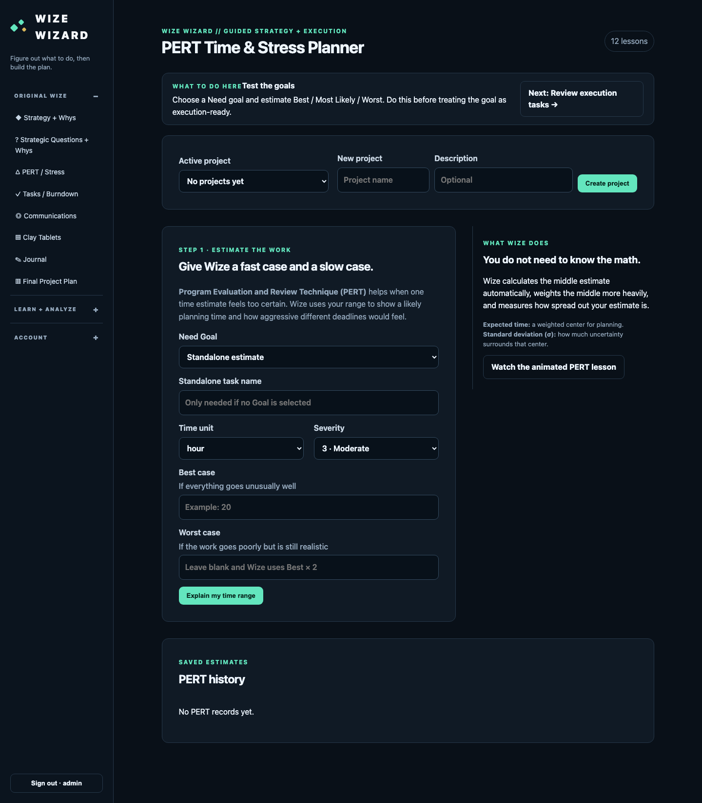
</p>

## 👥 Communication Complexity

Unstructured communication channels for `n` people:

```text
channels = n(n - 1) / 2
```

Wize Wizard compares that raw complexity with a structured model containing managers/product leads, contributor groups, stable contributor buddy pairs, and a coordination layer for remainders.

<p align="center">
  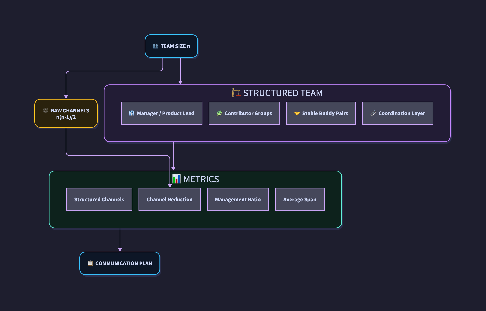
</p>

<p align="center">
  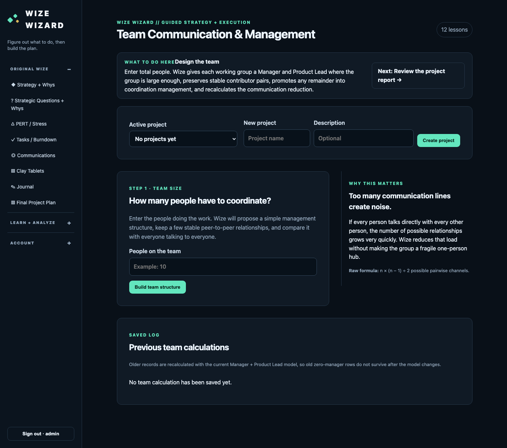
</p>

## ✅ Execution: Tasks + Burndown

Strategy is not left as prose. Needs can feed execution tasks with priority, status, source level, and related reasoning.

<p align="center">
  
</p>

## 🏺 Evidence: Clay Tablets + Journal

Clay Tablets preserve assumptions and strategy-linked evidence. The journal records observations made during execution.

<p align="center">
  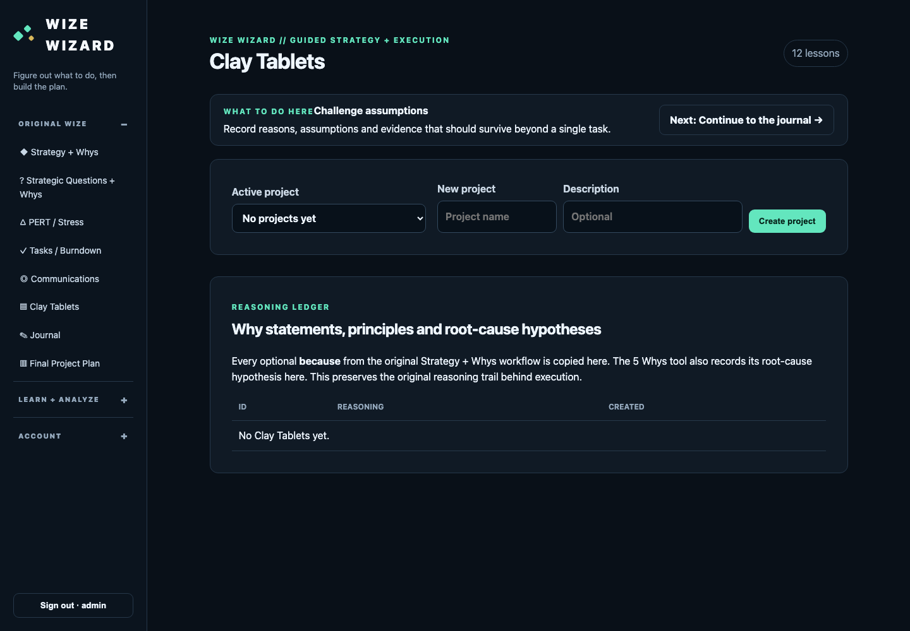
</p>

<p align="center">
  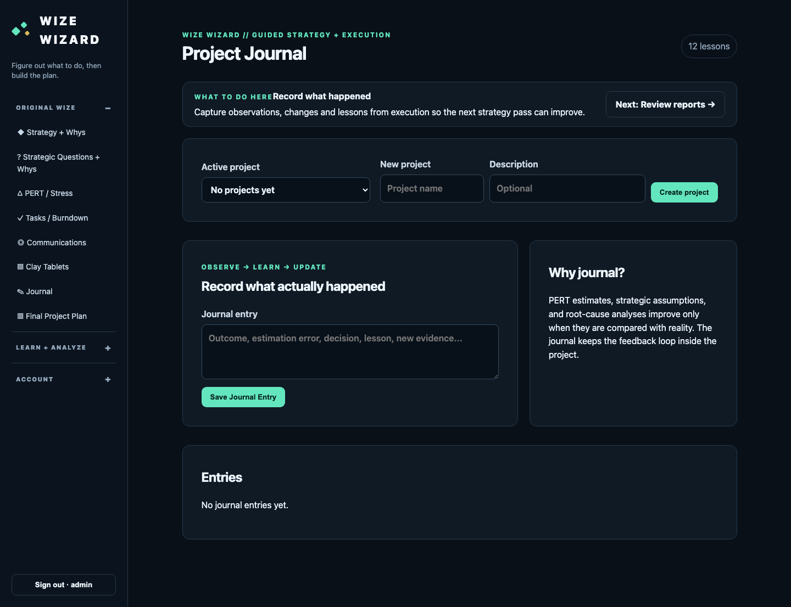
</p>

## 🎓 Learning System

Wize Wizard includes lessons and an embedded Strategy Handbook so the user can learn the concepts used by the workbench instead of merely filling out forms.

<p align="center">
  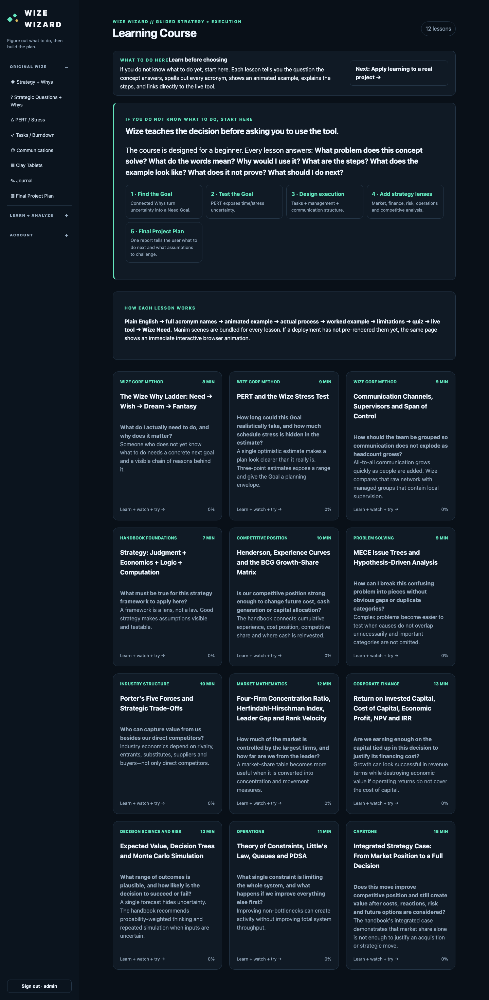
</p>

<p align="center">
  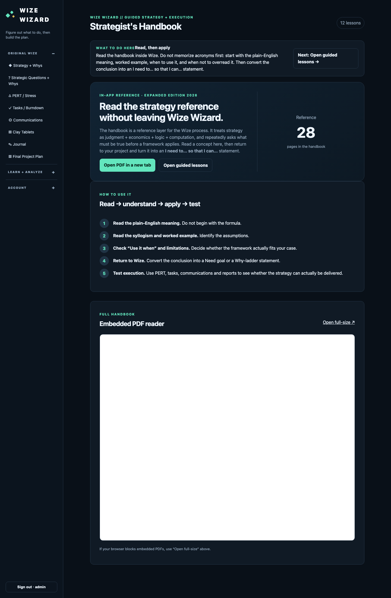
</p>

## 🔬 Analysis Labs

The application includes dedicated workspaces for:

- Market analysis
- Finance analysis
- Risk analysis

<p align="center">
  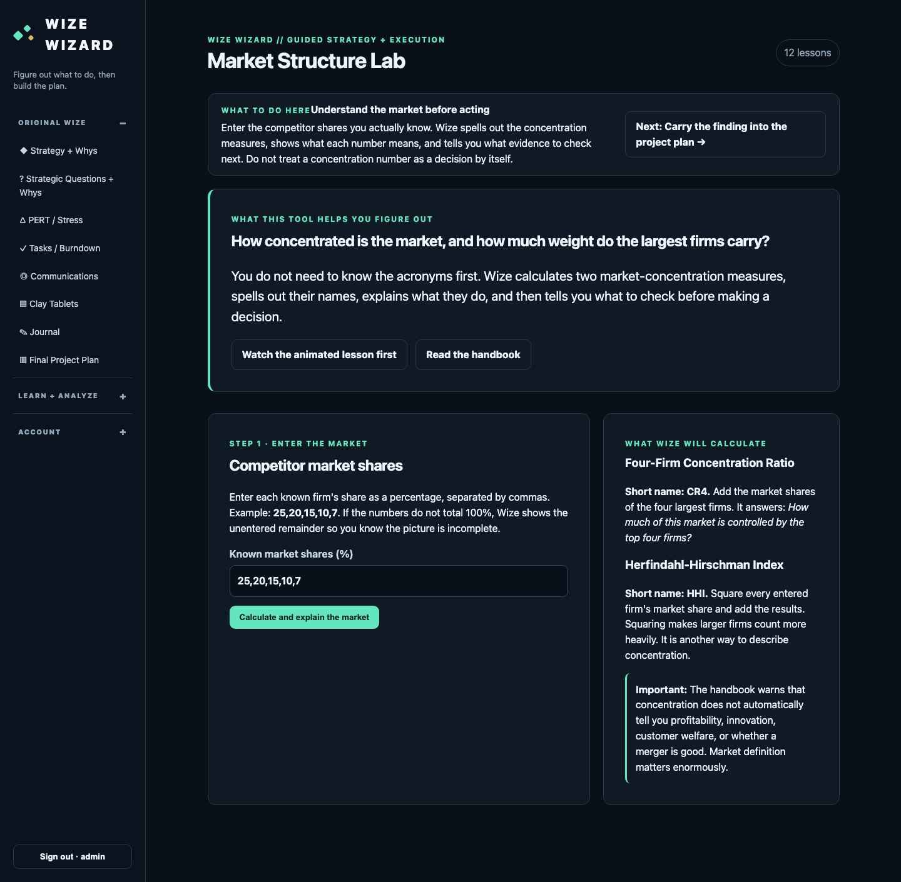
</p>

<p align="center">
  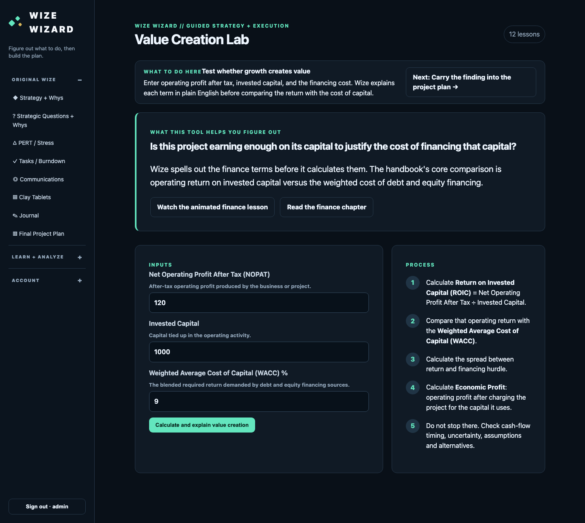
</p>

<p align="center">
  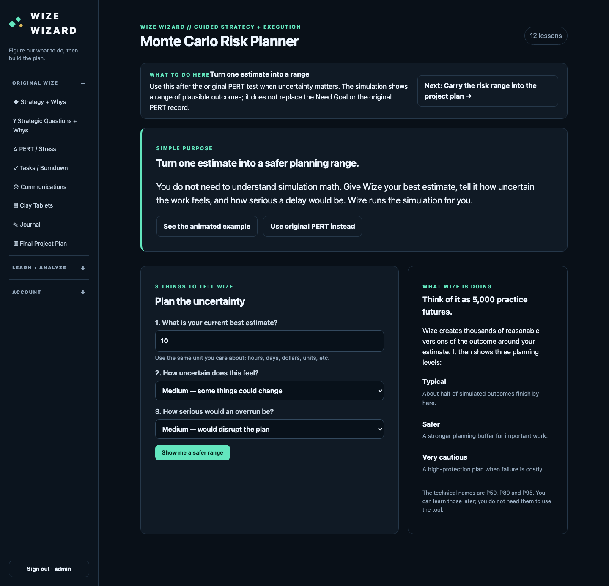
</p>

## 📋 Final Project Plan

The report consolidates the project's purpose, five Need goals, reasoning chains, estimates, tasks, communications, assumptions, journal evidence, analysis, and next actions.

<p align="center">
  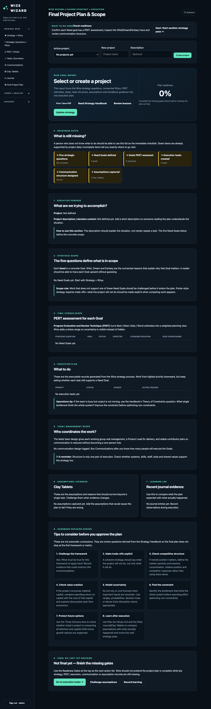
</p>

## 🏗️ Architecture

Wize Wizard is a Flask application served by Waitress and packaged as a non-root Docker container. Production persists SQLite under `/data`, binds the backend to host loopback, and exposes it through Nginx/TLS.

<p align="center">
  
</p>

### Runtime path

```text
Browser
  │ HTTPS
  ▼
wizard.richmackos.com
  │
  ▼
Nginx + TLS
  │ 127.0.0.1:5080
  ▼
Docker
  │
  ▼
Waitress :8080
  │
  ▼
Flask
  ├── Authentication
  ├── Strategy
  ├── Why reasoning
  ├── PERT
  ├── Tasks
  ├── Communications
  ├── Learning
  ├── Analysis labs
  ├── Evidence
  └── Reports
        │
        ▼
   SQLite /data/wize.db
```

### Data architecture

<p align="center">
  
</p>

## 🔐 Security Architecture

Security is checked at source, dependency, runtime, container, and deployment layers.

<p align="center">
  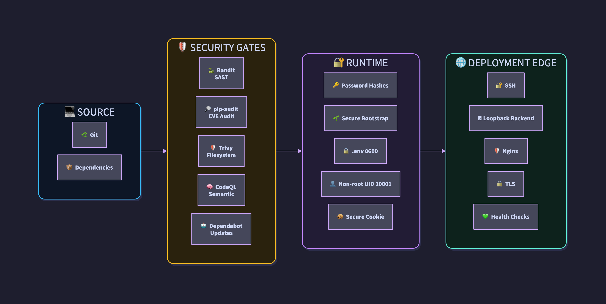
</p>

Controls include:

- Werkzeug password hashing
- no public default administrator password
- environment-driven initial administrator bootstrap
- `.env` excluded from source control
- production `.env` restricted to mode `0600`
- non-root Docker user, UID 10001
- secure-cookie production configuration
- loopback-only host binding
- Nginx TLS termination
- Bandit Python SAST
- pip-audit dependency auditing
- Trivy filesystem scanning
- CodeQL semantic analysis
- Dependabot dependency maintenance

## 🚦 CI/CD

<p align="center">
  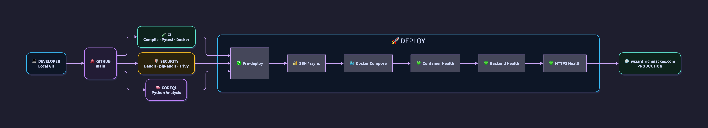
</p>

The repository contains dedicated workflows for CI, Security Hardening, CodeQL, publishing, and RichmackOS deployment.

Production verification checks:

```text
Docker container /healthz
        ↓
127.0.0.1:5080/healthz
        ↓
https://wizard.richmackos.com/healthz
```

## 🚀 Installation

### Requirements

- Python 3.10+
- Git
- pip
- SQLite support
- Optional: Docker + Docker Compose
- Optional: D2 for architecture rendering
- Optional: Manim for lesson animation rendering

### Clone over SSH

```bash
git clone git@github.com:iamrichmack111/wize-wizard.git
cd wize-wizard
```

### Create the environment

```bash
python3 -m venv .venv
source .venv/bin/activate
python -m pip install --upgrade pip
python -m pip install -e '.[dev]'
```

### Bootstrap the first administrator

There is no shipped `admin/admin` credential.

```bash
export WIZE_ADMIN_USERNAME=admin
read -rsp "Bootstrap password: " WIZE_ADMIN_PASSWORD
echo
export WIZE_ADMIN_PASSWORD
```

The bootstrap password must contain at least 12 characters.

### Start

```bash
wize-wizard-web
```

The package also exposes the terminal command:

```bash
wize-wizard
```

## 🐳 Docker Installation

Create `.env`:

```text
WIZE_ADMIN_USERNAME=admin
WIZE_ADMIN_PASSWORD=<strong-bootstrap-password>
```

Protect it:

```bash
chmod 600 .env
```

Start:

```bash
docker compose up --build
```

Production Compose uses:

```text
host 127.0.0.1:5080
          ↓
container :8080
          ↓
/data/wize.db
```

## 🧪 Development + Validation

Tests:

```bash
python -m pytest -q
```

Compile:

```bash
python -m compileall -q wize_wizard
```

Bandit:

```bash
bandit -r wize_wizard -ll -ii
```

Dependency audit:

```bash
python -m pip_audit
```

Playwright QA:

```bash
./run_wizard_playwright_qa.sh
```

## 📸 QA Evidence

The repository contains QA screenshots covering:

- Login
- Strategy
- Strategic Why chains
- PERT/stress
- Communications
- Lessons
- Market
- Finance
- Risk
- Handbook
- Final Project Plan
- User administration
- Tasks/burndown
- Clay Tablets
- Journal
- Password management
- Mobile layout

<p align="center">
  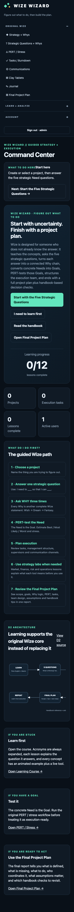
</p>

## 🗺️ Routes

| Route | Purpose |
|---|---|
| `/healthz` | service health |
| `/login` | authentication |
| `/change-password` | password management |
| `/` | project home |
| `/handbook` | Strategy Handbook |
| `/learn` | learning course |
| `/strategy` | strategy workspace |
| `/market` | market lab |
| `/finance` | finance lab |
| `/risk` | risk lab |
| `/wizard` | guided workflow |
| `/five-whys` | Five Whys |
| `/pert` | PERT/stress |
| `/tasks` | tasks/burndown |
| `/communications` | team design |
| `/clay-tablets` | evidence |
| `/journal` | project journal |
| `/reports` | final plan |
| `/admin/users` | user administration |

## 📁 Repository Layout

```text
.github/workflows/       CI/CD + security automation
animations/              lesson animation source
docs/                    documentation
docs/diagrams/           D2 architecture source
docs/images/diagrams/    rendered architecture assets
docs/screenshots/qa/     Playwright QA evidence
docs/wiki/               GitHub Wiki source
scripts/                 deployment + documentation automation
tests/                   automated tests
wize_wizard/             application package
```

## 📚 Documentation

Detailed documentation is available in `docs/` and the GitHub Wiki:

- Getting Started
- Installation
- User Guide
- Strategy and Five Questions
- Why Ladder
- PERT and Stress Analysis
- Communications Planning
- Tasks and Burndown
- Clay Tablets and Journal
- Learning System
- Reports and Project Plan
- Architecture
- Security
- CI/CD and Deployment
- Troubleshooting

## ✦ Design Philosophy

Wize Wizard is built around a simple idea:

> **Strategy should explain what must happen, why it matters, how uncertain execution is, who must coordinate, what evidence exists, and what happens next.**

The application keeps those layers connected from the first Need through the final Project Plan.
